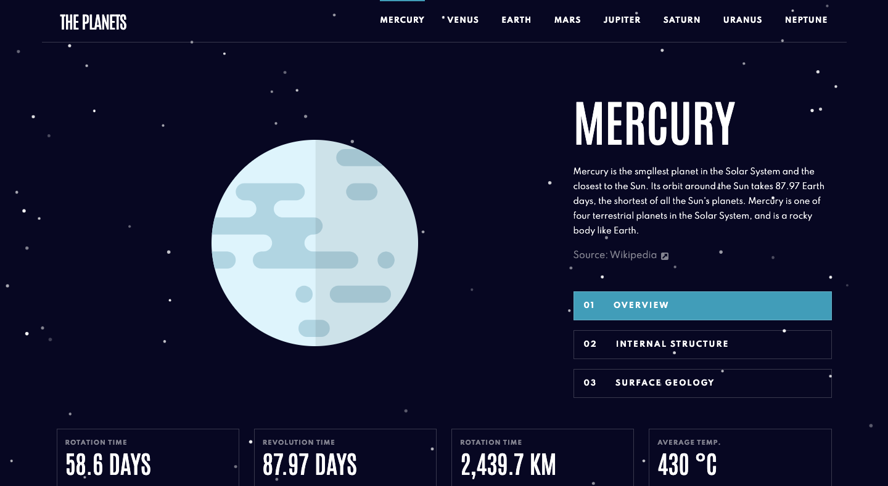

# Planets Facts Website | FEM Challenge

This is my 21st project which is one of the Frontend Mentor's challenges for displaying facts about planets. (responsive)

## Screenshot



## Get started

Install all modules and their dependencies that are listed on package.json file:

```bash
npm install
```

Create the public folder and start the live-server: (save one of the SCSS files afterwards to keep track of the changes correctly)

```bash
npm start
```

## Built with

- HTML
- CSS(SASS)
- JS
